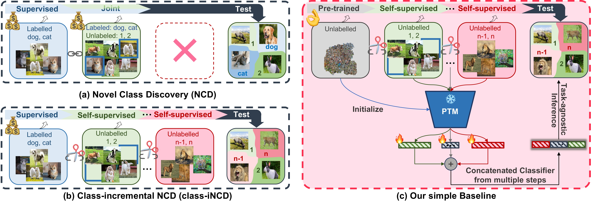

This Github repository contains the PyTor presents the PyTorch implementation for the ICPR 2024 paper **Large-scale Pre-trained Models are Surprisingly Strong in Incremental Novel Class Discovery** [[arXiv](https://arxiv.org/abs/2303.15975)].

> Large-scale Pre-trained Models are Surprisingly Strong in Incremental Novel Class Discovery
> 
> Accepted to International Conference on Pattern Recognition (ICPR) 2024, Kolkata, India
> 
> Mingxuan Liu, Subhankar Roy, Zhun Zhong, Nicu Sebe, and Elisa Ricci
>
> 




## Preparation

## Training

## Evaluation


## License
Please check the MIT license that is listed in this repository.

## Cite
If you find our framework or paper useful, please cite:

```bibtex
@article{liu2023large,
  title={Large-scale pre-trained models are surprisingly strong in incremental novel class discovery},
  author={Liu, Mingxuan and Roy, Subhankar and Zhong, Zhun and Sebe, Nicu and Ricci, Elisa},
  journal={arXiv preprint arXiv:2303.15975},
  year={2023}
}
```
---
The codebase for the adapted methods is created by [FRoST](https://github.com/OatmealLiu/class-iNCD), 
[ResTune](https://github.com/liuyudut/ResTune), [Mammoth](https://github.com/aimagelab/mammoth),
[AutoNovel](https://github.com/k-han/AutoNovel), and [OCRA](https://github.com/snap-stanford/orca). If you find these 
adapted methods useful, it would be appreciated if you acknowledge the original papers by citing them using the name and 
URL mentioned before.


