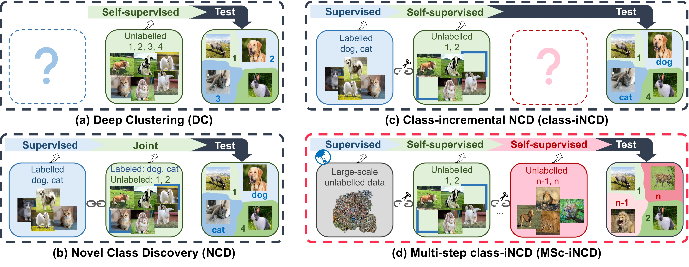

<div align="center">

# A Modular Framework for Multi-step Class-incremental Novel Class Discovery

---

<p align="center">
  <a href="#what-is-mscincd">What is MSc-iNCD</a> •
  <a href="#key-features">Key Features</a> •
  <a href="#license">License</a> •
  <a href="#cite">Cite</a>
</p>
</div>

---

> Large-scale Pre-trained Models are Surprisingly Strong in Incremental Novel Class Discovery
>
> Mingxuan Liu, Subhankar Roy, Zhun Zhong, Nicu Sebe, and Elisa Ricci
>
> 

This Github repository first presents the PyTorch implementation for the paper (pre-printed) **Large-scale Pre-trained Models are Surprisingly Strong in Incremental Novel Class Discovery** [[arXiv](https://arxiv.org/abs/2303.15975)].



##Code coming soon ☘️

## What is MSc-iNCD
A flexible modular PyTorch repository for the MSc-iNCD task, allowing for easy replication and adoption of not only our baselines,
but also typical Incremental Learning (IL), Novel Class Discovery (NCD), and class-incremental Novel Class Discovery (class-iNCD) methods that adapted to the new setting. 
It supports representative NCD (RankStats, OCRA, Sinkhorn+Swap) and IL (EwC, LwF, DER, CosNorm) 
components that allow users to develop new methods for the MSc-iNCD task.


## Key Features
We provide a flexible modular framework that supports representative NCD (RankStats, OCRA, Sinkhorn+Swap) and IL (EwC, LwF, DER, CosNorm) 
components, allowing users to develop new methods for the MSc-iNCD task. Experiments by default provide results on MSc-iNCD setting starting from a large-scale pre-trained model.
Furthermore, it supports supervised pre-training (used in NCD and class-iNCD) by using a certain (user-defined) amount of the novel classes as base classes in each data set.

| Setting | Supervised Pre-train | Large-scale Pre-train | Data Access |
| -----   | ------------------------- | ------------------------ | ------------ |
| Novel Class Discovery| &#9989; | &#10060; | &#9989; |
| Class-incremental Novel Class Discovery| &#9989; | &#10060; | &#10060; |
| Multi-step Class-incremental Novel Class Discovery | &#10060; | &#9989; | &#10060; |

Current available approaches and schemes include:
<div align="Left">
<p align="Left"><b>
  Training Scheme: Fine-tuning • Freezing • Joint

  Incremental components: EwC • LwF • DER • FRoST • ResTune • MSc-iNCD (Ours)

  Discovery components: RankStats • OCRA • Sinkhorn+Swap (Ours)
</b></p>
</div>


## License
Please check the MIT license that is listed in this repository.

## Cite
If you find our framework or paper useful, please cite:

```bibtex
@article{Liu2023LargescalePM,
  title={Large-scale Pre-trained Models are Surprisingly Strong in Incremental Novel Class Discovery},
  author={Mingxuan Liu and Subhankar Roy and Zhun Zhong and Nicu Sebe and Elisa Ricci},
  journal={arXiv preprint arXiv:2303.15975},
  year={2023}
}
```
---
The codebase for the adapted methods is created by [FRoST](https://github.com/OatmealLiu/class-iNCD), 
[ResTune](https://github.com/liuyudut/ResTune), [Mammoth](https://github.com/aimagelab/mammoth),
[AutoNovel](https://github.com/k-han/AutoNovel), and [OCRA](https://github.com/snap-stanford/orca). If you find these 
adapted methods useful, it would be appreciated if you acknowledge the original papers by citing them using the name and 
URL mentioned before.


